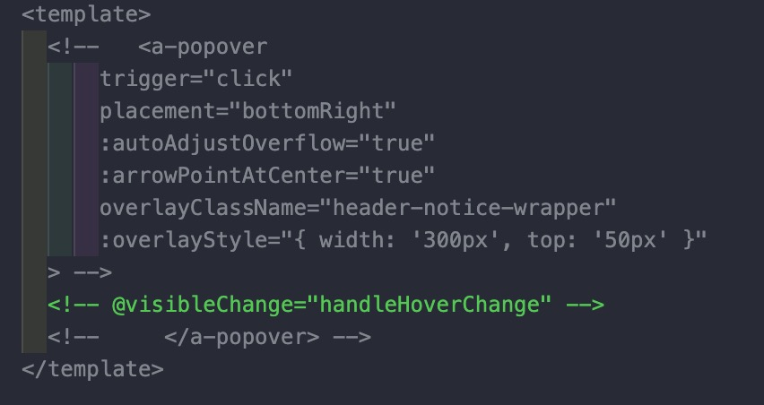
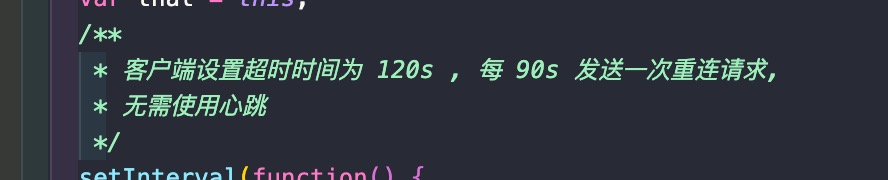

# project_customize_vscode_comment_style
Customize Vscode Code/Comment Style

> 通过本项目, 实现 vscode 的自定义代码颜色渲染

- [project_customize_vscode_comment_style](#project_customize_vscode_comment_style)
- [实现原理](#实现原理)
- [准备工作](#准备工作)
  - [学习 json.schemas](#学习-jsonschemas)
  - [启用 Scope inspector](#启用-scope-inspector)
- [开始配置](#开始配置)
  - [作用域信息收集](#作用域信息收集)
  - [处理作用域信息](#处理作用域信息)
  - [通过作用域来配置颜色](#通过作用域来配置颜色)
- [再进一步](#再进一步)
  - [集成第三方 theme(以 Dracula 为例 )](#集成第三方-theme以-dracula-为例-)
  - [用插件让您的注释更加绚丽!](#用插件让您的注释更加绚丽)


# 实现原理
通过设置 vscode settings.json 的 "editor.tokenColorCustomizations" -> "textMateRules" 来实现自定义代码颜色渲染

**Demo**  
如果您懒得折腾, 可以直接 `copy` 下面的配置代码到您的 settings.json, 即可简单实现 js/css 的单行/多行/块注释颜色自定义. 

然而, 如果您学习本项目, 可以完全实现 vscode 所有代码颜色的自定义, 何乐而不为呢? 
```
  "editor.tokenColorCustomizations": {
    // "[Dracula]": {
    "comments": "",
    "textMateRules": [
      {
        "scope": [
          "punctuation.definition.comment.html",
          "comment.block.html.vue-html",
          "meta.embedded.block.vue-html",
          "meta.block.template.vue",
          "meta.selector.css",
          "comment.line.double-slash.js",
        ],
        "settings": {
          "foreground": "#81868d",
        }
      },
      {
        "scope": [
          "comment.line.double-slash.js",
        ],
        "settings": {
          "foreground": "#99bbea",
        }
      },
      {
        "scope": [
          "comment.block.js",
        ],
        "settings": {
          "foreground": "#c8d1c3",
        }
      },
      {
        "scope": [
          "comment.block.documentation.js",
          "punctuation.definition.comment.begin.css",
          "comment.block.css",
        ],
        "settings": {
          "foreground": "#9df0ba",
          "fontStyle": "italic"
        }
      },
    ]
    // }
  },
```

效果如图





# 准备工作
## 学习 json.schemas 
通过配置 json.schemas, 来初步了解 vscode settings.json 的实现模式

**Reference**
> @note use json-schemas 
> https://json-schema.org/learn/
> 
> @demo 
> https://json-schema.org/learn/examples/card.schema.json

## 启用 Scope inspector
Scope inspector 是 vscode 内置的语法调试插件, 用该插件来显示 vscode 各作用域的语法定义

**Reference**
> https://code.visualstudio.com/api/language-extensions/syntax-highlight-guide#scope-inspector

> 完成这两步后, 我们的大项目开始啦 ! 

# 开始配置
## 作用域信息收集
这一步非常麻烦, 但是这是一切的基础. 将您的指针移到对应的代码上, `shift + control + alt + i` 使用 Scope inspector 来确定该代码的作用域, 效果如下图所示


其中, 
> *textmate* 就是我们需要的作用域内容, 每一行代表该代码包含的一个作用域, 越往上, 我们在 settings.json 中配置的优先级越高,
> *注意*: 同一组标签会区分为 open 和 end , 而注释会区分为注释头和注释文本, 皆为不同的作用域
> *foreground* 为当前生效的配置效果

反复执行本步, 直到搜集您想自定义设定的所有代码的作用域信息

## 处理作用域信息
将您搜集的作用域信息同一类去重, 并与其他类做非集, 最后的结果即为我们要控制的作用域, 这样才会您控制 a 元素颜色的时候, 不会影响到 b 元素的颜色

这里我使用了 java 代码来进行实现, 当然您也可以使用其他代码来实现本功能
[代码实现 VsCodeStyleUtil.java](VsCodeStyleUtil.java)

调用结果为:
```
 singleLineH5Result <!-- --> 
punctuation.definition.comment.html
comment.block.html.vue-html
meta.embedded.block.vue-html
meta.block.template.vue
meta.selector.css

 singleLineCodeResult // 
comment.line.double-slash.js

 multiLineResult /*  */ 
comment.block.js

 blockResult /**  */ 
comment.block.documentation.js
punctuation.definition.comment.begin.css
comment.block.css
```

## 通过作用域来配置颜色
打开 vscode settings, 点击右上角的, 打开 json 格式的 settings.json

配置如下: 
```
  "editor.tokenColorCustomizations": {
    // "[Dracula]": { // 用于指定是否配置某个theme的样式, 不指定则配置全局
    "comments": "", // 统一代码样式
    "textMateRules": [
      {
        "scope": [ // 作用域, 每一行为一个作用域
          "punctuation.definition.comment.html",
          "comment.block.html.vue-html",
          "meta.embedded.block.vue-html",
          "meta.block.template.vue",
          "meta.selector.css",
          "comment.line.double-slash.js",
        ],
        "settings": { // 配置颜色
          "foreground": "#81868d",
        }
      },
      {
        "scope": [
          "comment.line.double-slash.js",
        ],
        "settings": {
          "foreground": "#99bbea",
        }
      },
      {
        "scope": [
          "comment.block.js",
        ],
        "settings": {
          "foreground": "#c8d1c3",
        }
      },
      {
        "scope": [
          "comment.block.documentation.js",
          "punctuation.definition.comment.begin.css",
          "comment.block.css",
        ],
        "settings": {
          "foreground": "#9df0ba",
          // 配置字体
          "fontStyle": "italic"
        }
      },
    ]
    // }
  },
```

至此, 您已完成了 vscode 自定义颜色渲染的功能; 但是, 也许会存在一些问题

# 再进一步
## 集成第三方 theme(以 Dracula 为例 )
如果您使用了第三方theme, 您会发现, 某些 theme 定义的作用域优先级高于您的配置, 导致您的配置无法生效

这样, 我们以 vscode 最流行的 Dracula theme 为例, 来说明如何解决该问题

1. 先删除 vscode 中的 Dracula 插件, 重启 vscode

2. 下载并修改 Dracula 文件
```
git clone https://github.com/dracula/visual-studio-code.git ~/.vscode/extensions/theme-dracula
cd ~/.vscode/extensions/theme-dracula/src
vim dracula.yml
```

3. 在这里我要自定义配置的为 comment 相关的的内容
```
# 1. 寻找 comment 栏
/comment 
# 2. 将指针移到 scope 内, 
# 3. 将 - xxxx 作用域删除
dd
# 按 n 重复上一步删除所有 comment 相关的 scope 内容
# 保存退出
:wq!
```

结果如下: 
```

 589 # =============================================================================
 590 # Comments
 591 # =============================================================================
 592 
 593   - name: Comments
 594     scope:
 595     settings:
 596       foreground: *COMMENT
 597 
 5
```

4. 编译并运行
```
cd ~/.vscode/extensions/theme-dracula
npm install
node ./scripts/build.js 
```

5. 打开 vscode, 选择 dracula theme 即可

## 用插件让您的注释更加绚丽! 
better-comments 是一款用于 vscode 代码注释渲染的插件, 通过捕获注释代码行内的特殊字符, 来渲染指定的颜色

**Reference**
https://github.com/aaron-bond/better-comments

例子如下
```
"better-comments.multilineComments": true,
  "better-comments.highlightPlainText": false,
  "better-comments.tags": [
    {
      "tag": "@",
      "color": "#53c853",
      "strikethrough": false,
      "underline": false,
      "backgroundColor": "transparent",
      "bold": false,
      "italic": false
    },
    {
      "tag": "?",
      "color": "#57798f",
      "strikethrough": false,
      "underline": false,
      "backgroundColor": "transparent",
      "bold": false,
      "italic": false
    },
    {
      "tag": "//",
      "color": "#474747",
      "strikethrough": true,
      "underline": false,
      "backgroundColor": "transparent",
      "bold": false,
      "italic": false
    },
    {
      "tag": "todo",
      "color": "#FF8C00",
      "strikethrough": false,
      "underline": false,
      "backgroundColor": "transparent",
      "bold": false,
      "italic": false
    },
    {
      "tag": "*",
      "color": "#98C379",
      "strikethrough": false,
      "underline": false,
      "backgroundColor": "transparent",
      "bold": false,
      "italic": false
    }
  ],
  ```

  效果如下

  

  
